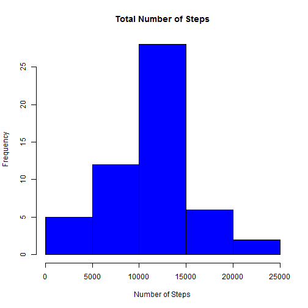
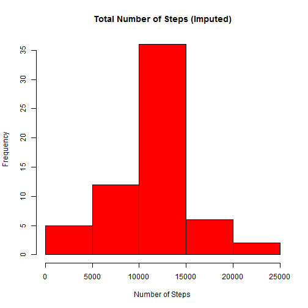

In this project we will look at some activity data from a personal activity 
monitoring device. This data was collected during the months of October and 
Novemeber 2012. It includes the numbers of steps taken in a 5 minute interval 
each day.  

###1) Code for reading the dataset and/or processing the data
Assuming the data has already been downloaded into the correct working directory.

```r
activity <- read.csv("activity.csv", header = TRUE, na.strings = "NA")
```

###2) Histogram of the total number of steps taken each day

```r
stepsByDate <- aggregate(steps ~ date, activity, sum)
hist(stepsByDate$steps, main = "Total Number of Steps", xlab = "Number of Steps",
     col = "blue")
```



###3) Mean and median number of steps take each day

```r
mean(stepsByDate$steps)
```

```
## [1] 10766.19
```

```r
median(stepsByDate$steps)
```

```
## [1] 10765
```

###4) Time series plot of the average number of steps taken

```r
stepsInterval <- aggregate(steps ~ interval, activity, mean)
plot(stepsInterval$interval, stepsInterval$steps, type = "l", 
     xlab = "Interval", ylab = "Number of Steps", 
     main = "Average Number of Steps per Interval")
```


###5) The 5-Minute interval that, on average, contains the maximum number of steps

```r
stepsInterval[which.max(stepsInterval$steps),]
```

```
##     interval    steps
## 104      835 206.1698
```

###6) Code to describe and show a strategy for imputing missing data
We want to fill in missing data from the steps column. To do this we will take the 
average from the interval for the missing value. We sum with is.na at the end to
make sure that all missing values have been removed from "steps".

```r
activityImputed <- activity
nas <- is.na(activityImputed$steps)
meanInterval <- tapply(activityImputed$steps, activityImputed$interval, 
                       mean, na.rm=TRUE, simplify = TRUE)
activityImputed$steps[nas] <- meanInterval[as.character(activityImputed$interval[nas])]
sum(is.na(activityImputed$steps))
```

```
## [1] 0
```

###7) Histogram of the total number of steps take each day after missing values are imputed.

```r
agg2 <- aggregate(steps ~ date, activityImputed, sum)
hist(agg2$steps, main = "Total Number of Steps (Imputed)", xlab = "Number of Steps",
     col = "red")
```



###8) Panel plot comparing the average number of steps taken per 5-minute interval across weekdays and weekends
To do this we will need the **lattice** package to be loaded.

```r
library(lattice)
weekdays <- c("Monday", "Tuesday", "Wednesday", "Thursday", "Friday")
activityImputed$daytype = as.factor(ifelse(is.element(weekdays(as.Date(activityImputed$date)),weekdays), "Weekday", "Weekend"))
agg3 <- aggregate(steps ~ interval + daytype, activityImputed, mean)
xyplot(agg3$steps ~ agg3$interval|agg3$daytype, main="Average Steps per Day by Interval",xlab="Interval", ylab="Steps",layout=c(1,2), type="l")
```


